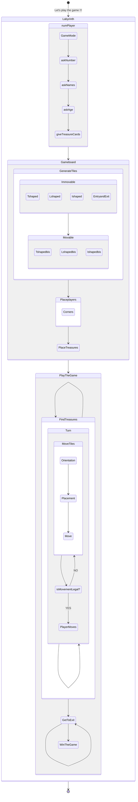

# Analysis Report

## Teacher in charge : Martin ROSALIE
## Names of the team : Marc REBIÈRE, Rami MEHAIBIA
## Class : L2 of Informatics/Computer Science

## Table of contents
1. [Introduction](#Intro)
2. [Analysis of needs](#Ana)

      The following two are a bit of a mix between Preliminary conception and Specifications

3. [The diagram](#Diag)
4. [Research of ideas](#Resea)
5. [Pseudocode (aka Detailed conception)](#Pseudo)
6. [Conclusion](#Conc)


# Introduction <a name="Intro"></a>

Hello everyone, our names are Marc REBIÈRE and Rami MEHAIBIA, today we will present to you our Analysis Report on our Project.

Our Project consists of making a Labyrinth game using C code.

In order to do it, we first need to do an Analysis on what we need (in a V-cycle style).

Hence the Analysis Report.

But before we begin, we will give you a basic explanation on what is the Labyrinth game.

The Labyrinth game is a board game, which consists of a 7 by 7 board with fixed tiles, movable tiles, treasure cards which correspond to some of the tiles (in total there are 24 treasures and 50 tiles) and 4 pawns.

The premise of the game is to collect all of the treasures assigned to you and then get out of the Labyrinth.

There will always be a tile outside of the gameboard, its use is to move the other tiles in the game to either make your way to treasure/exit or to block the path of the other players.

The youngest player begins and the exit is located at your spawn location.

And with the rules mumbo jumbo out of the way, we may begin our Analysis Report.

We hope you'll enjoy it!


# Basis <a name="Ana"></a>

So, first and foremost we need a list of what physical things we need in a game of Labyrinth, before we focus on functions and stuff like that (ignore the fact that we did this AFTER we did some pseudo code and diagrams and what not).

In a game of Labyrinth, we need a bunch of stuff :

- We need players
- We need tiles
- We need a gameboard
- We need treasures
- We eventually need a computer player, since we're into C programming aka computer job.

Now this is all fine and dandy but here is the thing, we need to go into further detail for each stuff...

## The players

We need their info, as in :

- Their names,
- Their age (to know who begins the game)
- Their position as well as their starting position (since that'll be the exit...) on the gameboard.
- Their corresponding colour (maybe?)
- Other stuff that doesn't come to my head, but you get the idea...

## The tiles

Essentially it's what and how we describe a tile in the Labyrinth Game (since they come in different statuses and stuff like that) :

- Their status on the gameboard (whether they're movable or not),
- Their "shape" (aka if they are I-shaped, L-shaped, T-shaped),
- Their potential treasure,
- Their orientation based on the basic shape,
- Their accessibility (aka if we can go left, right, up or down),
- Maybe other stuff ?

## The gameboard

It's the whole thing, the whole package, the place where we play the game... So it's going to need :

- A matrice of the tiles,
- A way of knowing what choices each player make,
- A way to monitor which turn we are (and therefore know who's turn it is...),
- A way to monitor if a move is legal or not (?)
- Add some stuff 'cause I don't really know...

## The treasures

Finally the things we're collecting before we get to win the game... and we need more so concepts rather than definitions :

- We need a list of treasures (which are going to be Roman inspired... list below actually :-))
- We need a list of treasures given randomly to each player (by randomly I mean, each player must have an equal number of treasures to find but randomly given to each of them)
- A way of validating that a player has found all of them treasures in order to win the game
- Maybe more ?


## And that's it... maybe ?

To be fair we're walking kind of blindly here, however below we'll get a little more intricate and detailled, right now we just kind of a shopping list in a language that could be interested by anyone... Below will be first a diagram showing how we're going to play the game, then a list of potential structs and functions and finally some pseudo code, Enjoy !


# The diagram of how to play the Labyrinth board game : <a name="Diag"></a>


#  The Labyrinth game will be composed of structs and functions (descriptions)... (thus a more detailled description) : <a name="Resea"></a>

## struct Player :

Contains :

- the name of the player(char type),
- the colour of the player(char type as well)(well not anymore),
- the age of the player (year in int, month in short int) //since the youngest player begins


## struct Tiles :

It contains :

- the presence of a treasure (bool),
- if said treasure is present, then which treasure it is ?
- The tile position (char),
- The shape of the tile  (enum case_shape),
- The tile orientation (enum case_orientation),
- If player is on tile or not  (bool),
- If there are multiple players on the same tile (bool),
- If there is a treasure (bool),
- If it is  the case which treasure it is ?(List of treasures)
- If tile is moveable or not (34 Movable, 16 Unmovable) (Movable or Unmovable),
- If the tile is outside the game area (bool),
- If we can access nearby tiles(bool).
- If we can, which ones?(Up, Down, Left, Right, NotUp, NotDown, NotLeft, NotRight),


## enum case_shape :

Its role is to create an enumeration dictating which shape is the tile :

There are :

- I shaped,
- L shaped,
- T shaped,

## enum case_orientation :

  Its role is to determine the orientation of the tile  based on its original orientation :

There are :

- Same,
- Left,
- Right,
- Inverse,

## Print the game function  :

It depends on:

- The state of the tiles,
- prints if a tile is moveable or not,
- prints player's position (A1, A2, B1, B3...),


Horizontal  line example:
_ _ _

|...|

|<->|

|...|

_ _ _

Vertical  line example :
_ _ _

|.^.|

|.|.|

|.v.|

_ _ _


## Check the game function :

It contains :

- if someone won (bool),
- if the precedent movement is canceled (bool),
- if someone took possession of a treasure (bool),
- if there are still treasure to be found per player (bool),
- if a player is in a findtheexit mode (bool),


## enum treasuretype :

Essentially a list of all the treasures that can be found in the game


## Additional information :

Movable :  12 I-shaped tiles , 16 L-shaped tiles , 5 T-shaped tiles .

Unmovable : 0 I-shaped tiles , 4 L-shaped tiles , 12 T-shaped tiles .

24 treasures total : 12 Unmovable Tshaped tiles, 6 Movable Tshaped tiles, 6 Movable Lshaped tiles

Here are some even more additional info


## List of Treasures:

|Column 1|Column 2|Column 3|Column 4|
|--------|--------|--------|--------|
|Dacia|Gallia|Britannia|Hispania|
|Egypt|Mesopotamia|Babylonia|Tripolitania|
|Armenia|Dalmetia|Macedonia|Thrace|
|Assyria|Numidia|Mauritania|Moesia|
|Galatia|Judaea|Pannonia|Aquitania|
|Raetia|Corsica|Sicilia|Sardinia|


# Pseudocode (aka Detailed design) <a name="Pseudo"></a>

```
structure of Age
begin
  integer called Year
  integer called Month
end
----------------
structure of position 
begin
  integer called x and called y
end
----------------
structure of Player
begin
  Table of ListOfTreasures called personalListTreasures
  string called Name
  age called Age
  Colours called colour //for character's colour, we're gonna put the basic ones...
  position called positionPlayer
  integer called treasurenumber //aka we're at which treasure exactly rn ?
  integer called Maxtreasure //the Max quantity of treasures this game...
  boolean called AccessExit
  boolean called win
  position called positionExit
end
----------------
enumeration of Shape
begin
   Ishaped and Lshaped and Tshaped
end
----------------
enumeration of Colours
begin
  Red and Blue and Green and Yellow
end
----------------
enumeration of Orientation
begin
  Same and Left and Right and Inverse
end
----------------
enumeration of ListOfTreasures
begin
   Nothing, Dacia, Gallia, Britannia, Hispania, Egypt, Mesopotamia, Babylonia, Tripolitania, Armenia, Dalmetia, Macedonia, Thrace, Assyria, Numidia,
   Mauretania, Moesia, Galatia, Judaea, Pannonia, Aquitania, Raetia, Corsica, Sicilia, Sardinia, Cyprus
end
----------------
enumeration of TileStatus
begin
  Movable and Unmovable
end

----------------
structure of Tile
begin
  Shape called shape
  Orientation called orientation
  Table of boolean size 4 called access // north south east west  
  ListOfTreasures called treasure
  TileStatus called tilestatus
  boolean called OutOfBounds
  boolean called IsPlayerPresent
  integer  called HowManyPlayers
  position called positionOfTile
end

----------------

structure of  Gameboard 
begin
  matrice of Tile called gameboard of size 7 by 7
  integer called choice //states the choice of the player 
  integer called turn //states the turn we're at...
end

----------------

return of nothing from GenerateTilesUnmovable(Gameboard called game)
begin
  for(i=0 to 7  with i advancing 2 by 2)
  begin
    for(j=0 to 7  with j advancing 2 by 2)
    begin
       game we call gameboard at position i at position j we call tilestatus=Unmovable
    iterate for
  iterate for

  game we call gameboard at position 0 at position 0 we call shape=Lshaped
  game we call gameboard at position 0 at position 0 we call orientation=Right
  
  game we call gameboard at position 0 at position 2 we call shape=Tshaped
  game we call gameboard at position 0 at position 2 we call orientation=Same
  
  game we call gameboard at position 0 at position 4 we call shape=Tshaped
  game we call gameboard at position 0 at position 4 we call orientation=Same
  
  game we call gameboard at position 0 at position 6 we call shape=Lshaped
  game we call gameboard at position 0 at position 6 we call orientation=Inverse
  
  game we call gameboard at position 2 at position 0 we call shape=Tshaped
  game we call gameboard at position 2 at position 0 we call orientation=Left
  
  game we call gameboard at position 2 at position 2 we call shape=Tshaped
  game we call gameboard at position 2 at position 2 we call orientation=Left
  
  game we call gameboard at position 2 at position 4 we call shape=Tshaped
  game we call gameboard at position 2 at position 4 we call orientation=Same

  game we call gameboard at position 2 at position 6 we call shape=Tshaped
  game we call gameboard at position 2 at position 6 we call orientation=Right

  game we call gameboard at position 4 at position 0 we call shape=Tshaped
  game we call gameboard at position 4 at position 0 we call orientation=Left

  game we call gameboard at position 4 at position 2 we call shape=Tshaped
  game we call gameboard at position 4 at position 2 we call orientation=Inverse

  game we call gameboard at position 4 at position 4 we call shape=Tshaped
  game we call gameboard at position 4 at position 4 we call orientation=Right

  game we call gameboard at position 4 at position 6 we call shape=Tshaped
  game we call gameboard at position 4 at position 6 we call orientation=Right

  game we call gameboard at position 6 at position 0 we call shape=Lshaped
  game we call gameboard at position 6 at position 0 we call orientation=Same

  game we call gameboard at position 6 at position 2 we call shape=Tshaped
  game we call gameboard at position 6 at position 2 we call orientation=Inverse
  
  game we call gameboard at position 6 at position 4 we call shape=Tshaped
  game we call gameboard at position 6 at position 4 we call orientation=Inverse

  game we call gameboard at position 6 at position 6 we call shape=Lshaped
  game we call gameboard at position 6 at position 6 we call orientation=Left 
 

end

----------------

return of integer from GameMode() 
begin
//asks the player if he or she wants to play player vs player or player vs computer
    integer  choice
    print(what would you want P v P or P v Com)
    scan(choice)
    if (choice = 1)
     begin
        return 1
      end     
    else
     begin
        return 2
     end
end

----------------

return table of Tile from GenerateTiles()
begin
  Table of Tile with size 50 called tiles
  integer called Maximum=50
  for(i=0 to Maximum)
  begin
    if(i<34)
    begin
       tiles at position i we call tilestatus=Movable
       if(i<12)
       begin
        tiles at position i we call shape=Ishaped
       end
      else if(i>=12 and i<28)
       begin
        tiles at position i we call shape=Lshaped
        end
      else
      begin 
       tiles at position i we call shape=Tshaped
      end
    end
  else
  begin
      tiles at position i we call tilestatus=Unmovable
      if(i<38)
      begin
       tiles at position i we call shape=Lshaped
      end
      else
      begin
      tiles at position i we call shape=Tshaped
     end
  end

    */
    Movable :  12 I-shaped tiles , 16 L-shaped tiles , 6 T-shaped tiles .
    Unmovable : 0 I-shaped tiles , 4 L-shaped tiles , 12 T-shaped tiles .
    */
  iterate for 
end

----------------

return of integer from askNumber()
begin
  integer called number
  print(How many players are you ?)
  scan(number)
  return number
end

----------------

return table of strings from askNames(integer called numplayers)
begin
  create table of strings called tab of size numplayers
  integer called i
  for(i=0 to numplayers)
  begin

    prints(What's player i+1's name ?)
    scan(tab at position i)
    
  iterate for
  return tab
end

----------------

return table of Age from askAge(integer called numplayers)
begin
  table of Age called tab of size numplayers
  integer called i
  for(i=0 to numplayers)
  begin
    print(What's player i+1's age ?)
    scan(tab at position i) 
  iterate for
  return tab
end

----------------

return table of Players from tabPlayers(integercalled numplayer,table of strings called names,table of Age called age)
begin
 
  table of Players called ptr of size numplayer
  for(i=0 to numplayer)
  begin
    ptr at position i we call Name=name
    ptr at position i we call Age=age
    ptr ptr at position i we call Colour=i // player 1 will be red, player 2 will be blue...
  iterate for
  return ptr
end

----------------

return integer from giveTreasureCards(integer called numplayer, table of Players called tabPlayers)
begin
  /*function that gives a random treasure (that won't be reiterated) for each player
  for example if we have 3 players, it would give each player 8 random treasure cards that won't be the same between the players...*/
  integer called treasures=24
  for(integer called k=0 to numplayer)
  begin
    tabPlayers at position k we call personalListTreasures gets memory allocated of treasures/numPlayer
  iterate for
  for (integer called i=0 to numplayer)
  begin
   for(integer called j=0 to treasures/numplayer)
    begin
     tabPlayers at position i we call personalListTreasures at position j=random treasure that does not repeat
    iterate for
  iterate for
  return treasures/numplayer
end

----------------


return boolean from isMovementLegal?(gameboard Game)
begin
  if(Game we call gameboard is not equal to Game we call gameboard two turns ago)
  begin
    return 1
  end
  else
  begin
   return 0
  end

end

----------------

return nothing from  Placeplayers(Gameboard called game,integer called  numPlayer,table of Players called list){
 switch(numPlayer):
case 1:
 print(error there shouldn't be only one player)
break
case 2:

  list at position 0 we call positionPlayer we call x=0
  list at position 0 we call positionPlayer we call y=0
  list at position 1 we call positionPlayer we call x=6
  list at position 1 we call positionPlayer we call y=0
  list at position 0 we call positionExit we call x=0
  list at position 0 we call positionExit we call y=0
  list at position 1 we call positionExit we call x=6
  list at position 1 we call positionExit we call y=0
  game we call gameboard at position 0 at position 0 we call IsPlayerPresent=1
  game we call gameboard at position 0 at position 0 we call HowManyPlayers=1
  game we call gameboard at position 0 at position 6 we call IsPlayerPresent=1
  game we call gameboard at position 0 at position 6 we call HowManyPlayers=1
break;

case 3:
  list at position 0 we call positionPlayer we call x=0
  list at position 0 we call positionPlayer we call y=0
  list at position 1 we call positionPlayer we call x=6
  list at position 1 we call positionPlayer we call y=0
  list at position 2 we call positionPlayer we call x=0
  list at position 2 we call positionPlayer we call y=6
  list at position 0 we call positionExit we call x=0
  list at position 0 we call positionExit we call y=0
  
  list at position 1 we call positionExit we call x=6
  list at position 1 we call positionExit we call y=0
  list at position 2 we call positionExit we call x=0
  list at position 2 we call positionExit we call y=6

  game we call gameboard at position 0 at position 0 we call IsPlayerPresent=1
  game we call gameboard at position 0 at position 0 we call HowManyPlayers=1
  game we call gameboard at position 0 at position 6 we call IsPlayerPresent=1
  game we call gameboard at position 0 at position 6 we call HowManyPlayers=1
  game we call gameboard at position 6 at position 0 we call IsPlayerPresent=1
  game we call gameboard at position 6 at position 0 we call HowManyPlayers=1

break
case 4:
  list at position 0 we call positionPlayer we call x=0
  list at position 0 we call positionPlayer we call y=0
  list at position 1 we call positionPlayer we call x=6
  list at position 1 we call positionPlayer we call y=0
  list at position 2 we call positionPlayer we call x=0
  list at position 2 we call positionPlayer we call y=6
  list at position 3 we call positionPlayer we call x=6
  list at position 3 we call positionPlayer we call y=6

  list at position 0 we call positionExit we call x=0
  list at position 0 we call positionExit we call y=0
  list at position 1 we call positionExit we call x=6
  list at position 1 we call positionExit we call y=0
  list at position 2 we call positionExit we call x=0
  list at position 2 we call positionExit we call y=6
  list at position 3 we call positionExit we call x=6
  list at position 3 we call positionExit we call y=6
  
  game we call gameboard at position 0 at position 0 we call IsPlayerPresent=1
  game we call gameboard at position 0 at position 0 we call HowManyPlayers=1
  game we call gameboard at position 0 at position 6 we call IsPlayerPresent=1
  game we call gameboard at position 0 at position 6 we call HowManyPlayers=1
  game we call gameboard at position 6 at position 0 we call IsPlayerPresent=1
  game we call gameboard at position 6 at position 0 we call HowManyPlayers=1
  game we call gameboard at position 6 at position 6 we call IsPlayerPresent=1
  game we call gameboard at position 6 at position 6 we call HowManyPlayers=1
break
default:
 print(error there are too many players)
end

----------------

return nothing from  GiveAccess(Tile called tile)
begin
  // Same, Left, Right, Inverse
  if(tile we call orientation equals to Same)
  begin
    if(tile we call shape equals to Ishaped)
    begin
      tile we call access=[1,1,0,0]
    end
    else if(tile we call shape equals to Lshaped)
    begin
      tile we call access=[1,0,1,0]
    end
    else if(tile we call shape equals to Tshaped)
    begin
      tile.access[0,1,1,1]
    end
  end
  else if(tile we call orientation equals to Left)
  begin
    if(tile we call shape equals to Ishaped)
    begin
     tile we call access=[0,0,1,1]
    end
    else if(tile we call shape equals to Lshaped)
    begin
     tile we call access=[1,0,0,1]
    end
    else if(tile we call shape equals to Tshaped)
    begin
     tile.access[1,1,1,0]
    end
  end
  else if (tile we call orientation equals to Right)
  begin
    if(tile we call shape equals to Ishaped)
    begin
    tile we call access=[0,0,1,1]
    end
    else if(tile we call shape equals to Lshaped)
    begin
     tile we call access=[0,1,1,0]
    end
    else if(tile we call shape equals to Tshaped)
    begin
     tile we call access[1,1,0,1]
    end
  end
  else if (tile we call orientation equals to Inverse)
  begin
    if(tile we call shape equals to Ishaped)
    begin
     tile we call access=[1,1,0,0]
    end
    else if(tile we call shape equals to Lshaped)
    begin
     tile e call access=[0,1,0,1]
    end
    else if(tile we call shape equals to Tshaped)
    begin
     tile we call access[1,0,1,1]
    end
  end

end

----------------

return nothing from  itsWhosTurn(table of Players called list, integer called numPlayer,Gameboard called game)
begin
  print(It's list (at position game we call turn % numplayer)we call Name's turn)//list[game->turn%numplayer].Name
end

----------------

return orientation from Orientation()
begin
  print(how do you want to orientate your tile ?)
  orientation  called var
  print(if you want to keep the Same orientation, press 0)
  print(if you want to rotate it Left, press 1)
  print(if you want to rotate it Right, press 2)
  print(if you want to invert it, press 3)
  scan(var)
  while(var<0 or var>3)
  begin
   print(try again: )
   scan(var)
  iterate while
  return var  
end 

----------------

return nothing from inserTile(Tile called tile,Gameboard called game)
begin
    //Placement
    integer called x and called y
    print(where would you want to put the tile?)
    scan(x and y)
    while((x!=0 and y!=1 )or(x!=0 and y!=3)or(x!=0 and y!=5)or(x!=6 and y!=1 )or(x!=6 and y!=3)or(x!=6 and y!=5)or(x!=1 and y!=0)or(x!=3 and y!=0)or(x!=5 and y!=0)or(x!=1 and y!=6)or(x!=3 and y!=6)or(x!=5 and y!=6))
    begin
      print(wrong position !!! try again)
      scan(x and y)
    iterate while
    if(x=0)
    begin
      // move vertically Down all the tiles of the position y
    end
    else if(x=6)
    begin
      //move vertically Up all the tiles of the position y
    end
    else if(y=0)
    begin
      // move horizontally Left all the tiles of the position x
    end
    else if(y=6)
    begin
      //move horizontally Right all the tiles of the position x
    end
end

----------------

return boolean from TreasureFound(table of Players called list,integer called Player, Gameboard  called game, adress of integer called numtreasure, integer called Maxtreasure)
begin
//returns if we're about to enter "find the exit mode"
  integer called i=list at position Player we call positionPlayer we call x
  integer called j=list at position Player we call positionPlayer we call y
  if(game we call gameboard at position i at position j we call treasure==list at position Player we call personalListTreasures at positioninteger pointed by numtreasure)
  begin
    integer pointed by numtreasure = integer pointed by numtreasure + 1
  end
  if(integer pointed by numtreasure>=Maxtreasure)
  begin
    return 1
  end
  else
  begin
   return 0
  end
end
----------------
return boolean from HasWon(Players called player)

begin
  if(player we call AccessExit equals to 1)

  begin
    if(player we call positionPlayer equals to player we call positionExit)
    begin
      return 1
    end
  end
  else
  begin
   return 0
  end
end

```

# Conclusion <a name="Conc"></a>

In conclusion,

We found it difficult to write all the functions necessary to make a Labyrinth game work, and we will probably need a bunch more, but we tried our best.

In addition, the date where we are supposed to give our assignement is today (05/03/2021), and if we don't give it in time, we're screwed!

Thank you for reading our Report,

In the hopes that you liked it, 

The Bombastic Duo,

Marc REBIÈRE Rami MEHAIBIA
