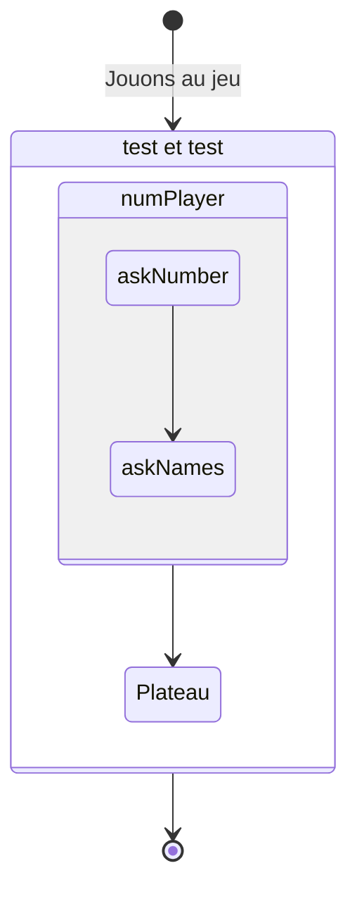

nous allons tester notre graphe

```mermaid
stateDiagram-v2
  [*]-->Game:Jouons au jeu
  
  Game:test et test
  state Game{
  numPlayer-->Plateau
  state numPlayer{
  askNumber-->askNames
  }
  
  }
  
  Game-->[*]


```

test du prof

```mermaid
graph TD;
  A-->B;
  A-->C;
  B-->D;
  C-->D;
```

